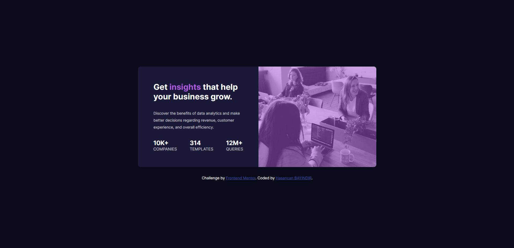

## My process

### Built with

- Semantic HTML5 markup
- CSS custom properties
- Flexbox

### What I learned


```html
Some CSS code I'm proud of
```

```css
.hero {
    min-height: 13rem;
    width: 440px;
    min-width: 300px;
    background: url(/images/image-header-desktop.jpg);
    background-repeat: no-repeat;
    background-size: cover;
    border-radius: 0 0.625rem 0.625rem 0;
    position: relative;
    overflow: hidden;
}

.image {
    display: block;
}

.hero .cover-img {
    width: 100%;
    height: 100%;
    top: 0;
    left: 0;
    position: absolute;
    background-color: hsla(277, 64%, 61%, 0.514);
    border-radius: 0 0.625rem 0.625rem 0;
}

@media only screen and (max-width: 375px) {
    body {
        flex-direction: column;
        font-size: 12px;
    }

    main {
        flex-direction: column-reverse;
        max-width: 300px;
    }

    .card-info {
        width: 300px;
        height: 500px;
        border-radius: 0 0 0.625rem 0.625rem;
        padding: 2rem;
    }

    .hero {
        min-height: 15rem;
        width: 300px;
        border-radius: 0.625rem 0.625rem 0 0;
        background: url(/images/image-header-mobile.jpg);
        background-repeat: no-repeat;
        background-size: cover;
        position: relative;
    }

    .hero .cover-img {
        width: 100%;
        height: 100%;
        top: 0;
        left: 0;
        position: absolute;
        background-color: hsla(277, 64%, 61%, 0.514);
        border-radius: 0.625rem 0.625rem 0 0;
    }
```
